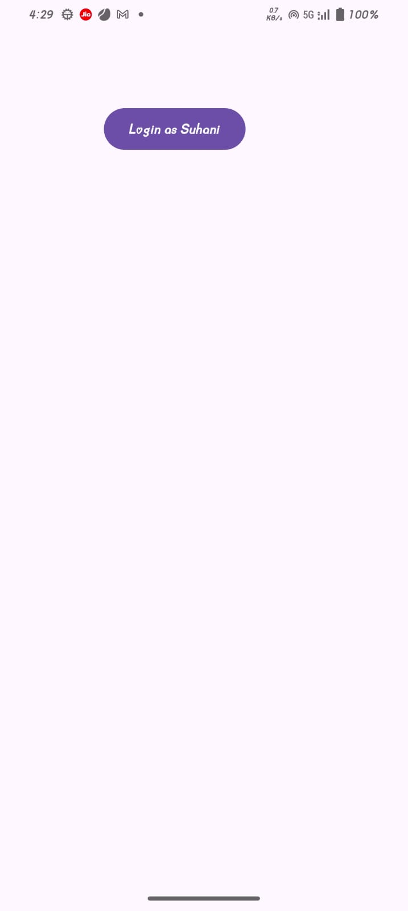
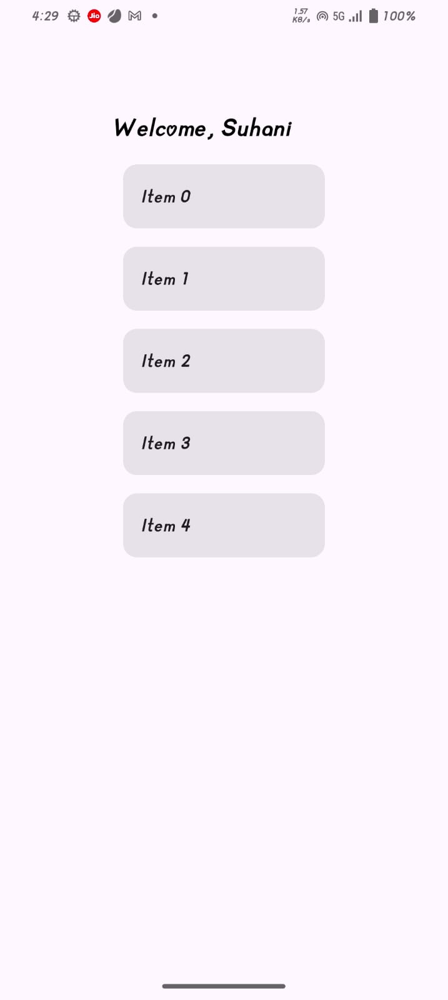
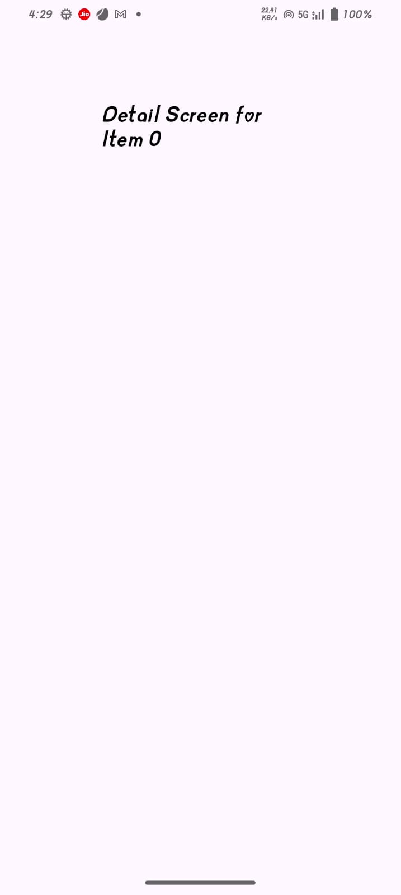

# 🧭 Navigation App (Jetpack Compose)

A simple Android app built with Jetpack Compose to practice Navigation between different screens. The app demonstrates how to set up navigation graphs and move between multiple composable screens.

# ✨ Features

Multiple screens built with Compose

Navigation Component for Compose

Passing data between screens

Simple and clean UI
# UI SCREENS
### LOGIN SCREEN

### HOME SCREEN

### DETAIL SCREEN

# 🛠️ Tech Stack

Kotlin

Jetpack Compose

Navigation for Compose

# 🎯 Purpose

This project was created to learn and practice navigation in Jetpack Compose, including screen transitions and argument passing.
